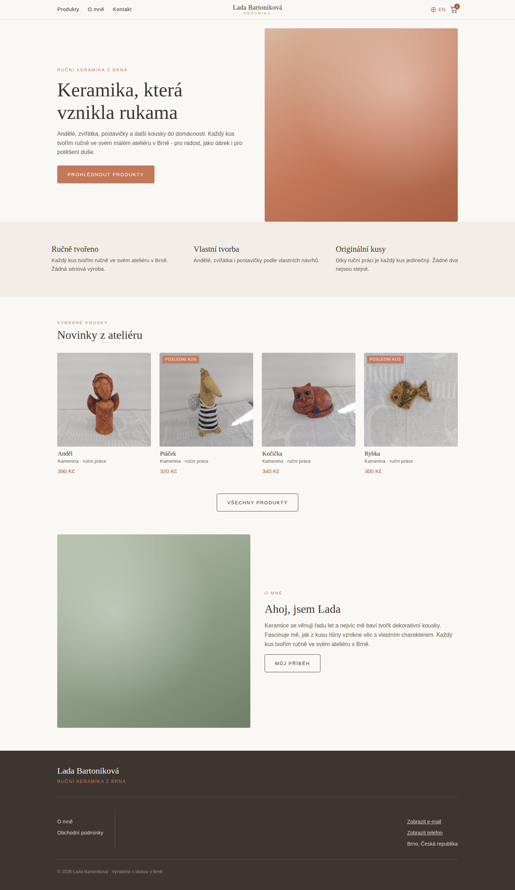
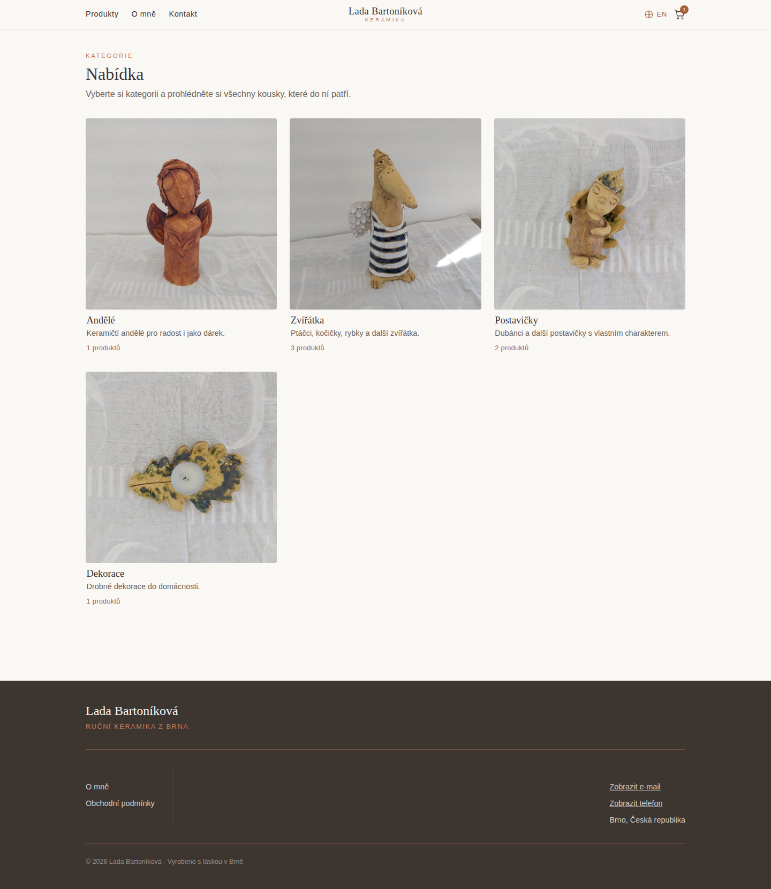
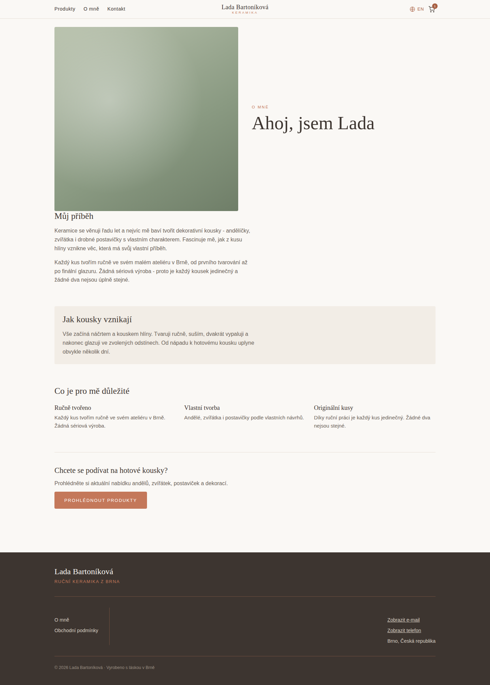
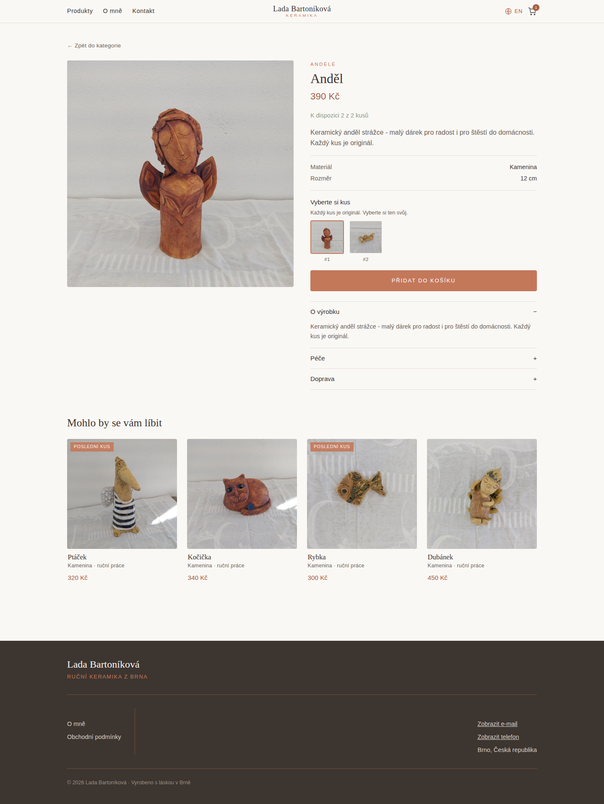
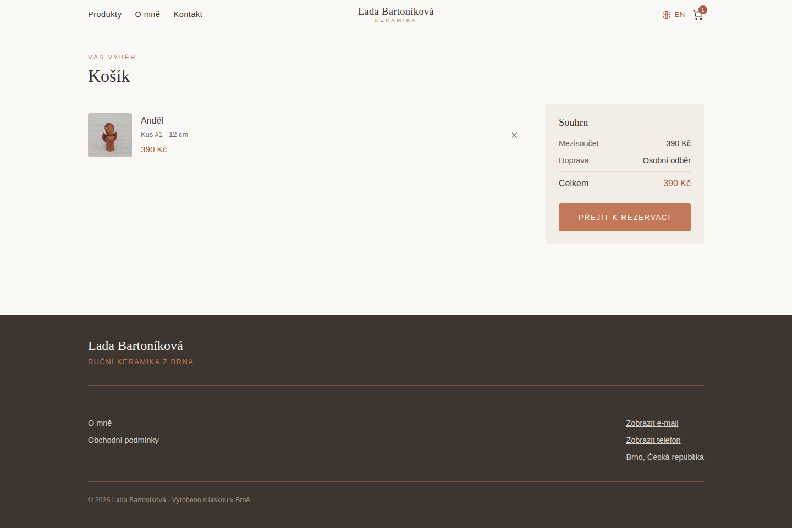
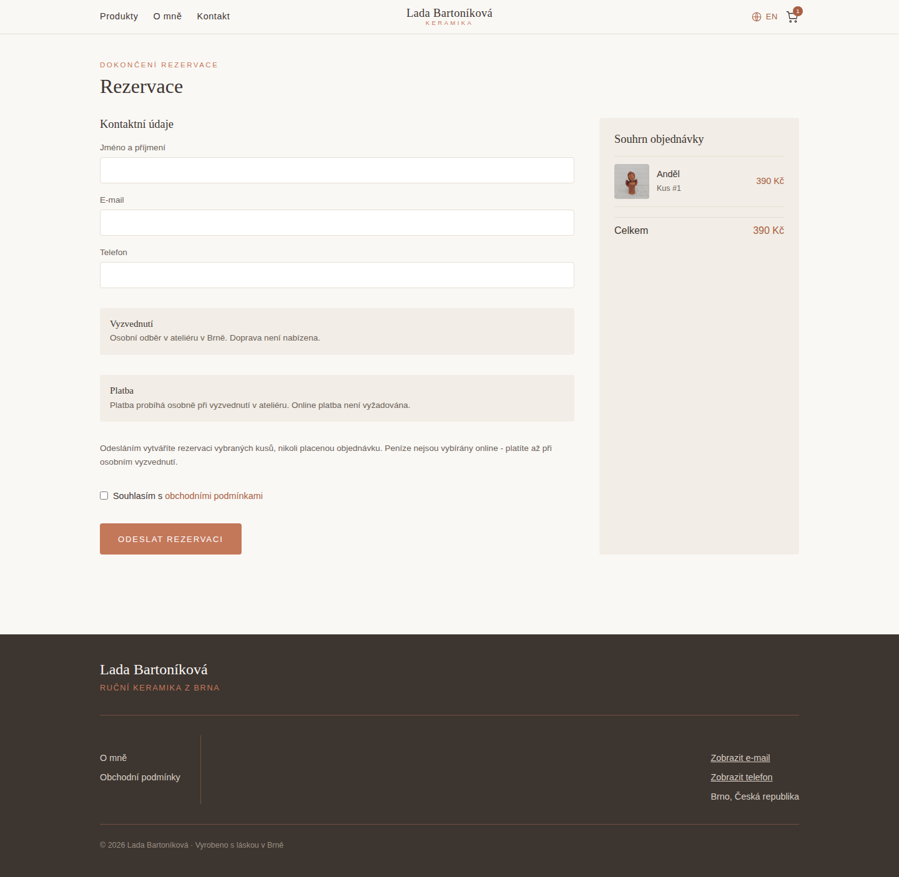
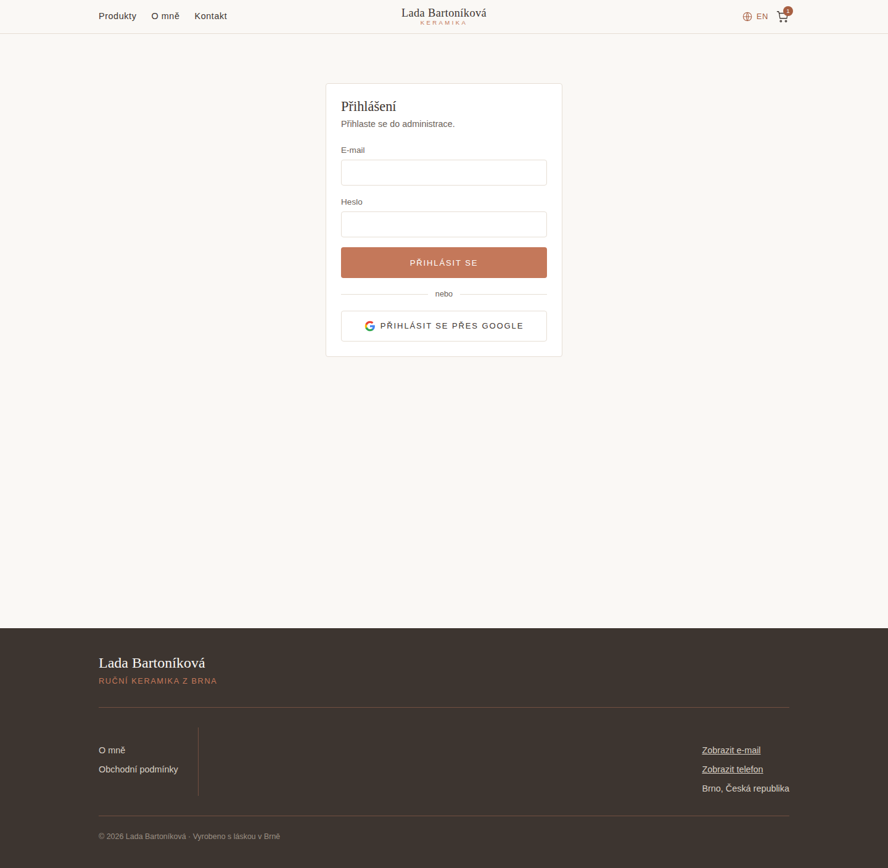
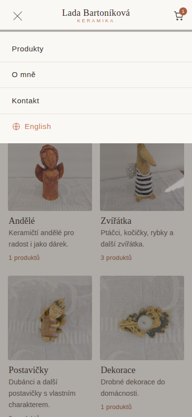
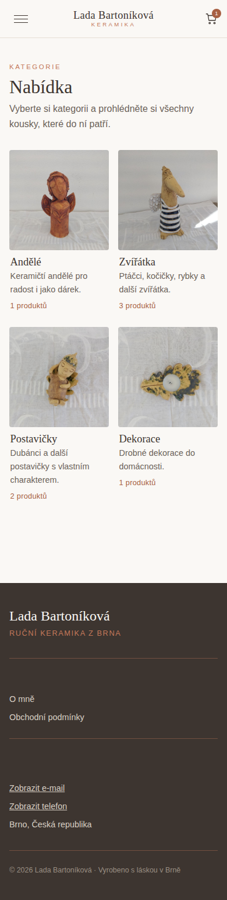

# Spacing / Layout Inconsistencies (audit notes)

Method: walked the running app with the Playwright MCP browser (desktop
1440x900 and mobile 390x844 viewports) across home, `/produkty`,
`/produkty/[category]`, `/produkt/[slug]`, `/cart` (empty + populated),
`/checkout`, `/kontakt`, `/o-nas`, `/obchodni-podminky`, the mobile nav
drawer, and the `/admin` login screen — using accessibility snapshots with
pixel bounding boxes (`box=x,y,w,h`) to get exact measurements, cross-checked
against the Tailwind utility classes in the corresponding `.svelte` files.
Screenshots for each page/state are saved in `.playwright-mcp/` (relative to
repo root) and linked from the relevant findings below. Findings below are
candidates for a later cleanup pass; nothing has been changed yet.

Screenshot index:

- `.playwright-mcp/01-home-desktop.png` — home, 1440px
- `.playwright-mcp/02-produkty-desktop.png` — category listing, 1440px
- `.playwright-mcp/03-produkt-detail-desktop.png` — product detail, 1440px
- `.playwright-mcp/04-cart-desktop.png` — cart with 1 item, 1440px
- `.playwright-mcp/05-checkout-desktop.png` — checkout, 1440px
- `.playwright-mcp/06-produkty-mobile.png` — category listing, 390px
- `.playwright-mcp/07-mobile-menu-open.png` — mobile nav drawer open, 390px
- `.playwright-mcp/08-o-nas-desktop.png` — About page, 1440px
- `.playwright-mcp/09-admin-login-desktop.png` — admin login screen, 1440px

## 1. Page-level top/bottom padding is inconsistent — ✅ FIXED

 ·
 ·
 ·

Most content sections use `px-4 pt-10 pb-16` (`/produkty`, `/produkty/[category]`,
`/kontakt`, `/obchodni-podminky`, `/cart`, `/checkout` — see
`02-produkty-desktop.png`). Previously:

- `/produkt/[slug]` used `pt-6 pb-16` (less top padding than its sibling
  `/produkty/[category]`). **Fixed:** changed to `pt-10 pb-16` to match —
  see the updated `03-produkt-detail-desktop.png`.
- Home's featured-products section used only `pt-16` with **no** `pb-*`.
  **Fixed:** added `pb-16` so the section has explicit bottom spacing
  instead of relying on the CTA button's own `pt-10`.
- Home's about-teaser section used `mt-16` (margin) to separate from the
  section above it. **Fixed:** removed the `mt-16` margin now that the
  section above supplies its own `pb-16`, so the gap between "Novinky z
  ateliéru" and the About teaser band now comes from one consistent
  padding-based mechanism instead of two competing ones — see the updated
  `01-home-desktop.png`.

Files changed: `src/routes/produkt/[slug]/+page.svelte`,
`src/routes/+page.svelte`.

## 2. Header block spacing (`eyebrow + h1 + intro`) varies by page — ✅ FIXED

 ·

Public listing/detail pages (`/produkty`, `/produkty/[category]`, `/kontakt`,
`/obchodni-podminky`, `/cart`, `/checkout`) use
`header class="mb-8 flex flex-col gap-[0.4rem]"` — see the eyebrow/h1/intro
stack above the category grid in `02-produkty-desktop.png`. Previously:

- Home's featured section header used `mb-6` instead of `mb-8`. **Fixed:**
  changed to `mb-8` so the gap above "Novinky z ateliéru" now matches the
  `/produkty` header — see the updated `01-home-desktop.png`.
- Admin dashboard/list headers (`/admin`, `/admin/kategorie`,
  `/admin/objednavky`, `/admin/produkty`) used `mb-6 flex flex-col gap-1`.
  **Fixed:** changed all four to `mb-8 flex flex-col gap-[0.4rem]` to match
  the public pages' heading+subtitle pattern exactly.

Files changed: `src/routes/+page.svelte`, `src/routes/admin/+page.svelte`,
`src/routes/admin/kategorie/+page.svelte`,
`src/routes/admin/objednavky/+page.svelte`,
`src/routes/admin/produkty/+page.svelte`.

## 3. Arbitrary rem values mixed with the standard spacing scale

Throughout the app, arbitrary values like `gap-[0.4rem]`, `gap-[0.15rem]`,
`gap-[0.1rem]`, `px-[0.1rem]`, `py-[0.6rem]`, `mt-[0.2rem]`, `mt-[0.15rem]`
are used side-by-side with standard scale utilities (`gap-1`, `gap-2`, `gap-4`,
`px-4`, `py-3`, `mt-1`). Visible as the slightly-off vertical rhythm inside
each category tile's text block (name / description / count) in
`02-produkty-desktop.png` — the spacing there doesn't correspond to any
standard scale step. There's no clear rule for when a one-off value is used
vs. the scale, making the rhythm feel accidental rather than systematic.

## 4. Two-column responsive layouts don't share a mobile gap

 ·
 ·

- `/produkt/[slug]` gallery/info split: `gap-8 md:flex-row md:gap-10` (gap
  visible between the image and info column in `03-produkt-detail-desktop.png`).
- `/cart` and `/checkout` line/summary split: `gap-10 md:flex-row md:gap-10`
  (gap between the item list and the summary aside in `04-cart-desktop.png`
  / `05-checkout-desktop.png`).
  These are visually the same kind of "stack on mobile, row on desktop" layout,
  but the mobile gap differs (8 vs 10) for no apparent content reason.

## 5. Summary "aside" card width differs between Cart and Checkout

 ·

Compare the "Souhrn" box on the right of `04-cart-desktop.png` (`md:w-72` =
288px) against the "Souhrn objednávky" box on the right of
`05-checkout-desktop.png` (`md:w-80` = 320px) — same component role (order
summary), visibly different width, likely unintentional drift since checkout
was probably copied from cart.

## 6. Three different "back link" styles in the admin area

- `/admin/produkty/[slug]`, `/admin/produkty/novy`, `/admin/kategorie/[slug]`:
  `mb-4 inline-block text-[0.85rem] text-accent-dark hover:underline`.
- `/admin/objednavky/[id]`:
  `mb-6 inline-block text-[0.85rem] text-ink-soft transition-colors hover:text-accent-dark`.
- Public back links (`/produkt/[slug]`, `/produkty/[category]`), visible as
  "‹ Zpět do kategorie" at the top of `03-produkt-detail-desktop.png`:
  `mb-6 inline-block text-[0.85rem] tracking-[0.02em] text-ink-soft transition-colors hover:text-accent-dark`.
  All three represent the identical "‹ back to list" affordance but use three
  different margin/color/hover treatments (admin variants require login to
  screenshot, confirmed in code).

## 7. Loading-state paragraph spacing not shared

Nearly every admin page uses `py-10 text-center text-ink-soft` for the
"loading…" / empty / error message. But the top-level admin auth gate in
`+layout.svelte` (shown behind the login form before it resolves — see
`09-admin-login-desktop.png` for the post-load state) uses `py-20
text-center text-ink-soft` for its "loading…" state — same semantic state,
double the vertical padding. (The loading flash itself is too fast to
screenshot reliably; confirmed in code.)

## 8. Header bar heights differ (public vs admin) without an obvious reason

 ·

Compare the header bar height in `01-home-desktop.png` (public
`Header.svelte`, `px-4 py-3`) against the header bar in
`09-admin-login-desktop.png` (admin `+layout.svelte`, `px-4 py-4`) — the
admin header renders visibly taller for the same nav-bar role.

## 9. `--header-h` CSS var used but never set

`Header.svelte`'s mobile backdrop uses `top-[var(--header-h,3.75rem)]`, but
`--header-h` is not defined/set anywhere in the codebase — it always falls
back to the hardcoded `3.75rem` (60px). See finding #12 below for the live
pixel measurement of the resulting misalignment, visible as a thin sliver of
page content peeking through above the dimmed backdrop in
`07-mobile-menu-open.png`.

## 10. Section-to-section rhythm on `/o-nas` vs `/` (About teaser) differs

 ·

The standalone About page (`08-o-nas-desktop.png`) uses a `gap-16` flex
column for its sections (Story / Process / Values / CTA), each with its own
smaller internal `gap-4`/`gap-6`. The homepage's About _teaser_ section
(bottom band of `01-home-desktop.png`) instead uses `mt-16` margin plus
internal `gap-4` — mixing margin-based and gap-based rhythm for what should
likely be one consistent "section separation" pattern across the site.

## 11. Category & product grid item inner padding uses arbitrary values inconsistently

 ·

`ProductCard.svelte` (product tiles in `01-home-desktop.png`) and the
category tile markup (`02-produkty-desktop.png`) both use `px-[0.1rem]
py-[0.6rem]` for the text block under the image — consistent between the
two, but this arbitrary pairing doesn't correspond to any scale step, so any
future new grid tile is likely to drift from it (as already happened with
the header/eyebrow spacing in finding #2).

## 12. Confirmed live: mobile nav backdrop/drawer top offset is off by 5px

Measured directly in the browser at 390x844 (see `07-mobile-menu-open.png`):
the header's actual rendered height is **65px** (`box=0,0,390,65`), but the
mobile menu backdrop (`button "Zavřít menu"`) starts at **y=60** and the
dropdown `nav` starts at **y=64**. This is the live symptom of finding #9
(`--header-h` fallback of `3.75rem` = 60px never matches the real ~65px
header) — there's a visible ~1-5px sliver of backdrop/drawer misalignment
under the header on mobile, worst on the products/category pages where the
header wraps to its full height.

## 13. Checkout order-summary panel is noticeably narrower than Cart's, despite more content

 ·

Measured directly in the browser at 1440px wide:

- `/cart` summary `aside` (`04-cart-desktop.png`): `box` width **288px**
  (`md:w-72`), for 3 rows (subtotal/shipping/total).
- `/checkout` summary `aside` (`05-checkout-desktop.png`): `box` width
  **320px** (`md:w-80`), for a full order line list _and_ only a total row.
  Both summary widths are arbitrary and disconnected from their content's
  actual needs (confirms finding #5 with live measurements): the checkout
  summary is wider because it also stacks a product-line item, not because of
  any deliberate width decision — the two "order summary" boxes should share
  one width/pattern.

## 14. Product detail page: gallery column and info column are unequal widths but visually expected to align

On `/produkt/andel` at 1440px (`03-produkt-detail-desktop.png`), the gallery
is `box=160,128,540,540` (square, 540px) and the info column is
`box=740,128,540,785`, i.e. both columns are exactly `md:w-1/2` of the
1120px content width (540px each) as coded. This part is actually
consistent — no bug — but flagged here because the generous whitespace
below the square image (image height 540px vs. info column height 785px,
visible as empty space under the thumbnail row in the screenshot) makes the
two columns look unbalanced at a glance; the accordion/spec section in the
text column has no matching visual anchor in the image column. Worth a
design pass, not necessarily a spacing "bug".

## 15. Category tile description text reserves inconsistent vertical space across tiles

On `/produkty` mobile (390px, `06-produkty-mobile.png`), tile text blocks
vary in height because the description wraps to different line counts
("Andělé" block height 115px vs. "Postavičky" block height 138px), which
shifts the "N produktů" line to a different y position per card and breaks
the grid's baseline alignment. Visible in the screenshot as the misaligned
"1 produktů" / "3 produktů" price-count lines between the "Andělé" and
"Zvířátka" tiles on the first row. Consider clamping the description to a
fixed number of lines (e.g. `line-clamp-2`) so every tile's price/count line
sits at the same y across a row.

---

### Suggested next step

Introduce a small set of shared layout primitives (e.g. a `PageSection`
wrapper component or shared utility classes for "page shell padding",
"section header stack", and "loading/empty state") so pages stop
independently re-deriving slightly different spacing values for the same
visual pattern.
